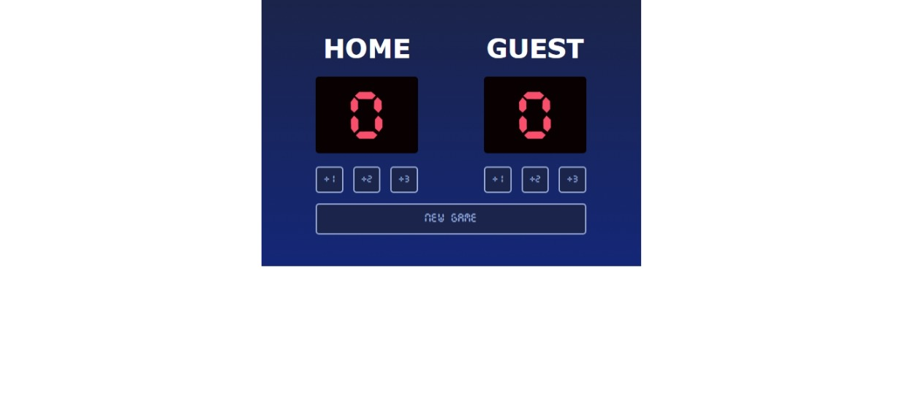

# Scrimba Bootcamp - Solo Projects

This is a solution to the [M3 - Basketball Scoreboard](https://scrimba.com/scrim/cz9adVfP).

## Screenshot

## Links

- Live Site: [Netlify](https://symphonious-puffpuff-38c0e6.netlify.app/)
- Codebase: [Github](https://github.com/abilioassis/basketball-scoreboard)
- Code review: [Scrimba](https://scrimba.com/scrim/co05847f9aa9c29e71d70f727)

## Built with

- Semantic HTML5 markup.
- Flexbox.
- No frameworks (only pure HTML and CSS 🏅).

## Author

- [Abilio Assis](https://www.linkedin.com/in/abilio-assis/)
